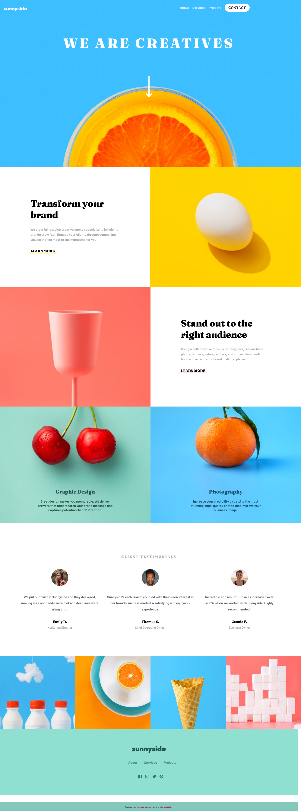

# Frontend Mentor - Sunnyside agency landing page solution

This is a solution to the [Sunnyside agency landing page challenge on Frontend Mentor](https://www.frontendmentor.io/challenges/sunnyside-agency-landing-page-7yVs3B6ef). Frontend Mentor challenges help you improve your coding skills by building realistic projects.

## Table of contents

- [Overview](#overview)
  - [The challenge](#the-challenge)
  - [Screenshot](#screenshot)
  - [Links](#links)
- [My process](#my-process)
  - [Built with](#built-with)
  - [What I learned](#what-i-learned)
  - [Continued development](#continued-development)
  - [Useful resources](#useful-resources)
- [Author](#author)

## Overview

### The challenge

Users should be able to:

- View the optimal layout for the site depending on their device's screen size
- See hover states for all interactive elements on the page

### Screenshot



### Links

- Solution URL: [FrontEnd Mentor](https://www.frontendmentor.io/solutions/created-using-html5-css-flexbox-css-grid-mobile-first-approach-4piTptvO4Y)
- Live Site URL: [Github Pages](https://nkirukka.github.io/sunny-side_agency/)

## My process

### Built with

- Semantic HTML5 markup
- CSS custom properties
- Flexbox
- CSS Grid
- Mobile-first approach
- JavaScript

### What I learned

This is my first ever full-scale/semi full-scale front-end project and I had much fun(and some headache) building it.
Two great things I learned:

1. NAVBAR - How to create a navbar from scratch without any frameworks or libraries. I added funtionality with JS of course. This challenge uses just the hamburger icon to toggle the nav menu on and off so I could have saved myself some headache by not including the close icon but I did it anyway.

2. MAX-HEIGHT - At first the header image and main section were overlapping and I tried several fixes(object-fit, calc(100vh - header and footer height) for the main) but I discovered the wonders of max-height and finnaly solved it.

3. ::BEFORE & ::AFTER - Before now, I was not aware you could do more than insert quotes, a few letters or an icon with these pseudo elements. Turns out the world of these guys are so much more vast and you can do magical(a little exxagerated but you get it) things with them like create different shapes, add overlays and mix-blend modes and so much more I am sure I'm yet to discover.

4. ICONS - Oh my days! Adding a close icon stressed me out so much. The icons would show in development but once hosted would refuese to show on Mozilla, Chrome or Safari. I tried different icons sites...Material Icons, Font-Awesome, Icons-8... downloaded different formats..SVG, PNG..you name it, nothing worked!
If you're facing this same issue, here's a solution for you: move the script for the icon above the link to your custom stylesheet! So simple! 


Display gallery depending on screen size.
```html
  <section class="gallery">
      <div></div>
      <div></div>
      <div></div>
      <div></div>
    </section>
    <section class="desktop-gallery">
      <div></div>
      <div></div>
      <div></div>
      <div></div>
    </section>
```

Did you know you could change the color of any svg or icon to white by using the filter property like below?
```css
footer .social-media img:hover{
filter: brightness(0) invert(1);
transition: .2s;
}
```

### Continued development

I plan to take on more front-end projects and eventually, full-stack ones. 

Media query is a feature I plan to continue to enlighten myself on as I find myself using as many as 10 but industry experts say at most 4 is enough.

### Useful resources

- [Add github submodules](https://gist.github.com/kevincolten/315e27402f97a66def62) - This helped me understand how to host more than one page on Github Pages.
- [Flex shorthand explained](https://css-tricks.com/understanding-flex-grow-flex-shrink-and-flex-basis/) - This is an amazing article which helped me finally understand flex shorthand(flex-grow, flex-shrink and flex-basis).

## Author

- LinkedIn - [Nkiruka Ebele](linkedin.com/in/nkiruka-ebele-8b03bb17a)
- Frontend Mentor - [@nkirukka](https://www.frontendmentor.io/profile/nkirukka)
